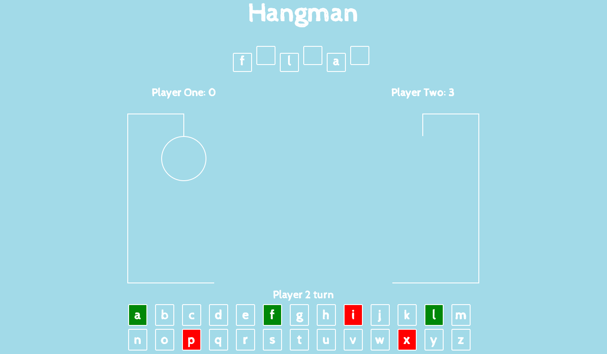
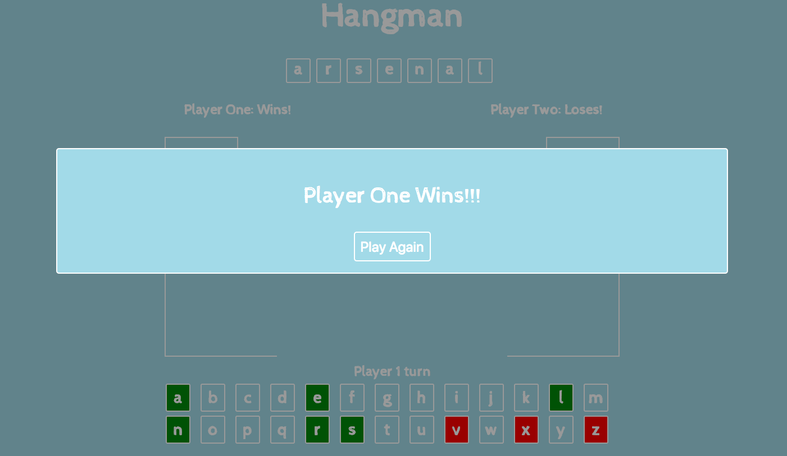

#Hangman - Project One

## Game Instructions
### The aim of the game is to guess the word before your opponent does.

1. Player one goes first and guesses a letter by pressing the relevant key on the keyboard.

2. If the letter is correct the word will appear in the boxes and the assosiacted key tile will turn green, and it will continue to be their turn. If the letter is incorrect, the letter will not appear in the box, the assosicated key will turn red, the first part of the hangman will appear and it will move onto the second players turn.

3. The winner is the player who guesses the most letters in the word or the person whose hangman figure isn't fully created.

## Technologies Used
<ul>
	<li>HTML5</li>
	<li>CSS</li>
	<li>JavaScript</li>
	<li>jQuery</li>
	<li>Google Fonts</li>
	<li>Github</li>
	<li>HTML Audio</li>
</ul>

## Approach Taken
1. Once I had decided on my idea I broke the project down into different sections. The first section was to have an array of words and make sure a word was selected at random everytime.

2. After this I needed to register what the user inputted and match that against the random word that was selected earlier.

3. Once I had the result of whether the user input matched the random word, I would then add it to the correct position in the HTML if the word was correct or write an error message if it was present.

4. At this stage I felt it necessary to create a better way of displaying whether the user guessed correctly or not which I did using CSS. I added a keyboard display on the page and it the user guessed correctly the relevant key would turn green and if it was an incorrect guess it would turn red.

5. I needed to create a hangman element that would be used in the game, I created this using different CSS elements.

6. Now that the hangman image had been created i needed to add functionality that meant every incorrect guess another piece of the hangman would appear. I did this using the opacity class in CSS and controlling it using jQuery. When the page loads all the pieces of the hangman are hidden using opacity:0 and when the user guesses incorrectly jQuery changes the next piece of the hangman to opacity:1.

7. Next I needed to add a winning function. This means that if the accumilation of letters inputted by the user matches the random word selected at the start then the player wins. And if the hangman has been fully created then the user loses.

8. The main functionality of the game was working but it was only for one player, so the next step was to add in a second user. The majority of the code was similiar to the functionality of one player but small changes had to be made.

9. Now that the game can be played by two players, the functionality to see which player was the winner needed to be implemented. I added a point to each user every time they got a letter correct and once the word had been correctly guessed created the logic to say whichever user had the higher score was the winner. I also added the losing condition, whichever user's hangman was completed first loses.

10. The last thing that was needed was to create more visually appealing interface for the game and to implement some nice features that make the game more fun for the user, such as the audio files that play when the users guesses correctly or incorrectly.

##Wins
<ul>
	<li>Having only been taught jQuery and certain areas of JavaScript and CSS for a short period of time, I was pleased that I was able to implement the logic that the game involved.</li>
	 
	<li>I was pleased that I was able to make the game two player, as I feel that it adds an extra competitive edge to the game and makes it more fun to play.</li>
	 
	<li>Having only spend two days on the project I feel that I achieving a fully functioning two player game is a good achieving and shows the progess that I am making.
</ul>
	
## Blockers
<ul>
	<li>The main difficulty I had when working on the project was if the letter the user inputted featured twice in the chosen word making it display at both indicies. I was using 'indexOf' method to match the letter inputted to the chosen word but that only returns the first index of the letter, so if it appeared twice it would only print at the first location. In order to get around this issue I created an array that stored all the indicies that the inputted letter appeared in the word. </li>
	 
	<li> Another issue that I encountered on the project was the program returing an error for every time the letter didn't appear in the chosen word. For example, if the letter entered was 'e' and the word was 'apple' and error would be printed 4 times before the success function was called. After looking more closely at the code, I realised this was due to the positioning of the else statement and once this was moved to the correct position it worked properly.</li>
	 
	<li>Floating the two hangmen characters and then having the keyboard sit below that without the float caused difficulties when making the interface more user friendly. However, once I correctly implemented the clear function everything was positioned correctly.</li>
	
##Future Features
Due to having a limited time to complete the project not all the features that I would have wanted were implemented. Below are the features that if I had more time and that I will add in the future.
<ul>
	<li>Using an API of words instead of having predefined words stored manually in an array. This would add thousands more words into the game without them having to be stored in the JavaScript file.</li>
	 
	<li>I would create a modal to appear at the start asking the users for their names. The names would appear instead of the 'Player One' and 'Player Two' phrases. I feel this would make the game more personal to the user.</li>
	 
	<li>Making the game mobile responsive is a feature that I really want to add. People use their phones to go online and it is important that the site responds to that demand.</li>
	 
	<li>During the development I thought about having a clue function. I decided against putting it in because I thought it may make the game too easy, but if I had used an API to retrieve the words I feel this would be a necessary feature.</li>
	 
	<li>A definate future improvement would be making my code more 'DRY'. Currently the code isn't how I want it to be due to the limited time for development.</li>

